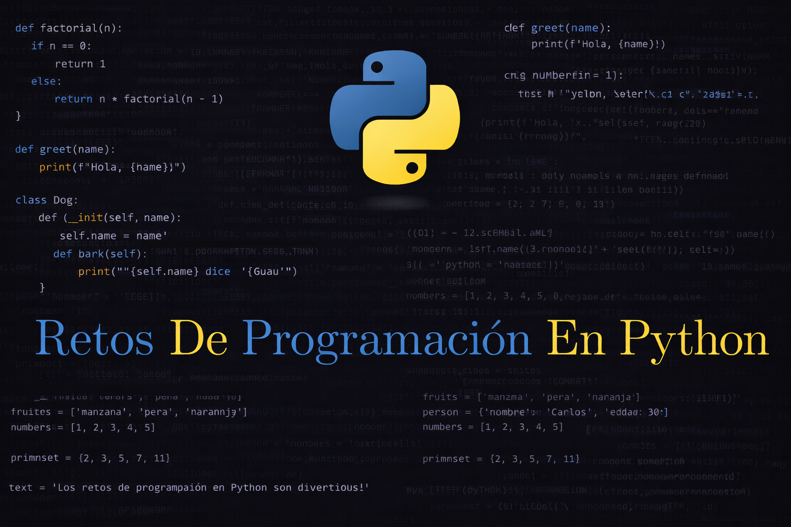

  

# **Retos de Programación en Python**

## Descripción

Colección de retos de programación en **Python** diseñados para fortalecer la lógica de programación y desarrollar habilidades prácticas en el lenguaje.

## **Objetivos**

- Desarrollar y mejorar la lógica de programación.
- Aprender y reforzar el uso de Python mediante la resolución de problemas.
- Fomentar el pensamiento algorítmico y la resolución estructurada de retos.

## **Organización de los Retos**

Los retos están organizados en carpetas según su nivel de dificultad:

- **Fácil**
- **Medio**
- **Difícil**

Cada carpeta contiene ejercicios acordes al nivel, permitiendo un progreso gradual.

## **Fuentes de los Retos**

Los ejercicios están basados y adaptados a partir de los siguientes repositorios de GitHub:

- https://github.com/codin-eric/ejercicios_yt
- https://github.com/mouredev
